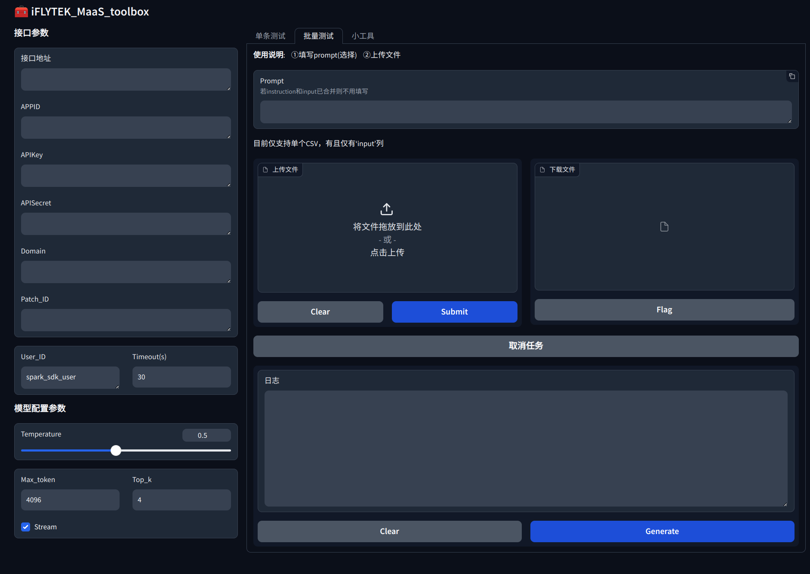

# iFLYTEK_MaaS_toolbox

## 项目地址

* Github：[https://github.com/Fakerfigure/iFLYTEK_MaaS_toolbox](https://github.com/Fakerfigure/iFLYTEK_MaaS_toolbox)，如果有帮助，Star不迷路！

## 简介

本项目是基于Gradio搭建的服务于[讯飞开放平台](https://training.xfyun.cn/overview)的工具箱，支持调用微调模型进行bot聊天，批量数据测试，以及数据转换如：JSONL转CSV，CSV转JSONL。

<div style="text-align: center;">

<p style="text-align: center;">该图片由星火大模型生成</p>
</div>


项目基于[spark_ai_python](https://github.com/iflytek/spark-ai-python/blob/main/README.md)开发，如过您对该SDK感兴趣，请点击进一步学习！

## 界面介绍

WebUI主要由四个版块组成

- 接口参数区
- Chatbot（单条测试）
- 批量测试
- 小工具

<div style="text-align: center;">

<p style="text-align: center;">Chatbot（单条测试）</p>
</div>

左侧为接口参数，需要在[讯飞开放平台](https://training.xfyun.cn/overview)获得哦

<div style="text-align: center;">

<p style="text-align: center;">批量测试</p>
</div>

批量测试与Chatbot共享同一个接口信息

<div style="text-align: center;">

<p style="text-align: center;">小工具</p>
</div>

注意：

CSV转JSONL格式如下：

- CSV
  
| input | output |
|-------|--------|
| 你是谁   | 我是…… |
|这个项目好吗|特别好|
|你Star了吗|当然咯|

- JSONL

```json
{"input":"你是谁","output":"我是……"}
{"input":"这个项目好吗","output":"特别好"}
{"input":"你Star了吗","output":"当然咯"}
```

## 本地部署

**项目仅支持 Python3.8+**

#### 拉取项目

```
git clone https://github.com/Fakerfigure/iFLYTEK_MaaS_toolbox.git
cd iFLYTEK_MaaS_toolbox
```
#### 配置环境依赖

- 创建虚拟环境
```bash
    # 可选
    conda create -n toolbox python=3.10
    codna activate toolbox
```

- 安装依赖
```bash
    pip install -r requirement.txt
```
#### 启动

```bash
    python web_UI.py
```

